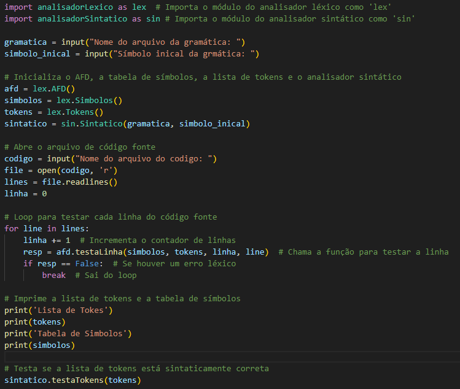
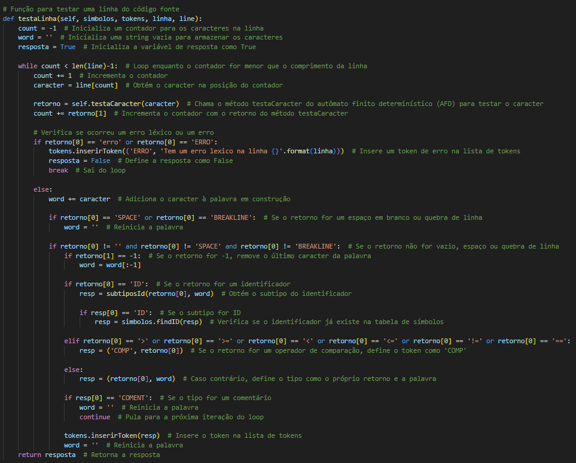
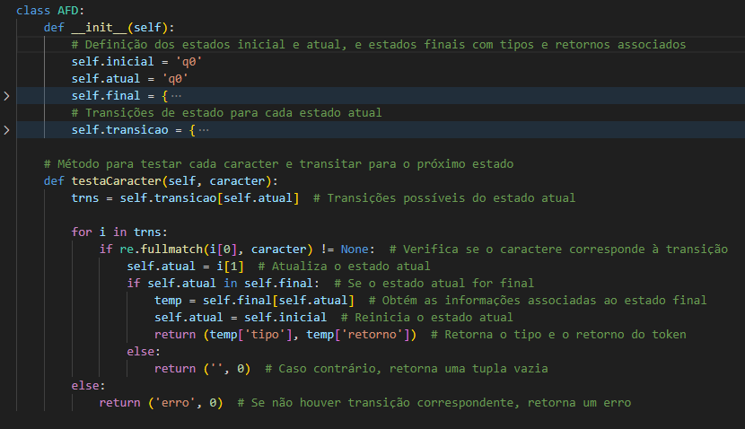
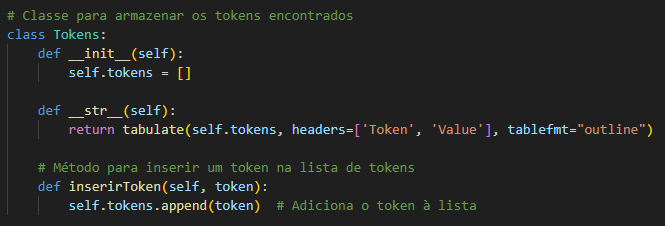
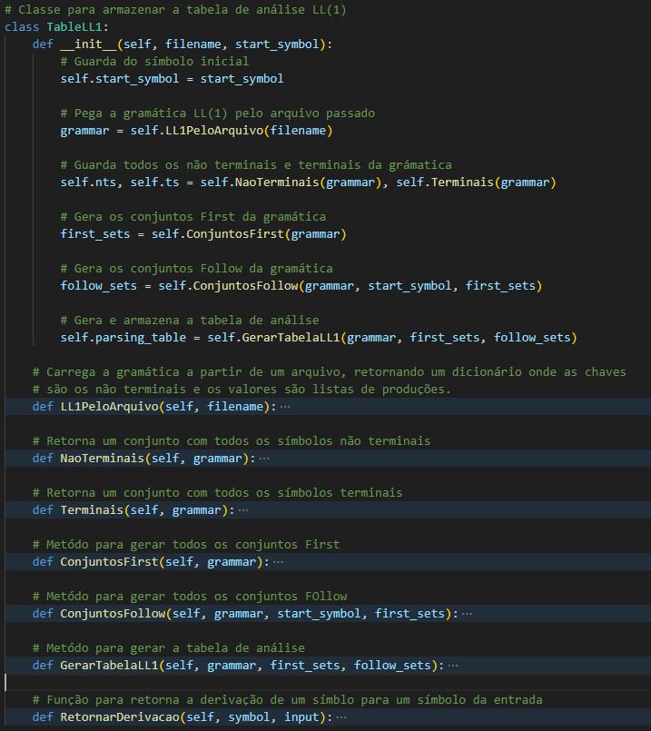
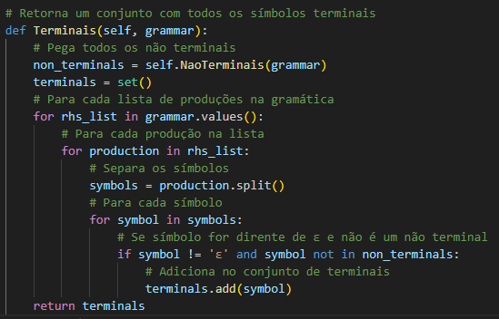
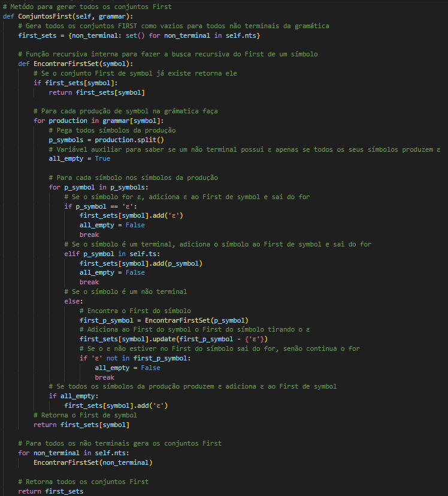
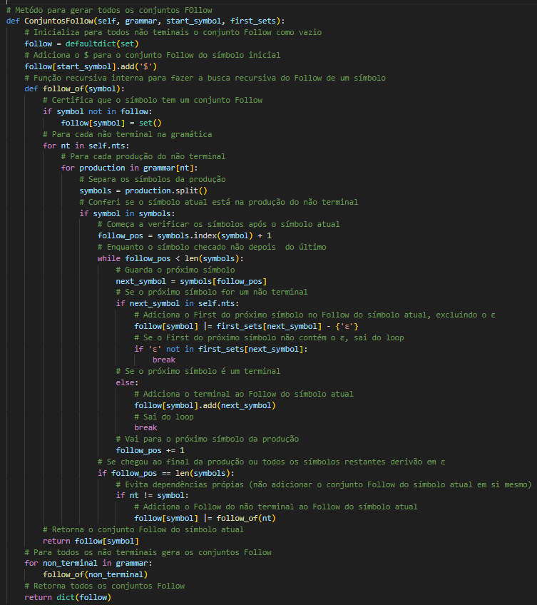
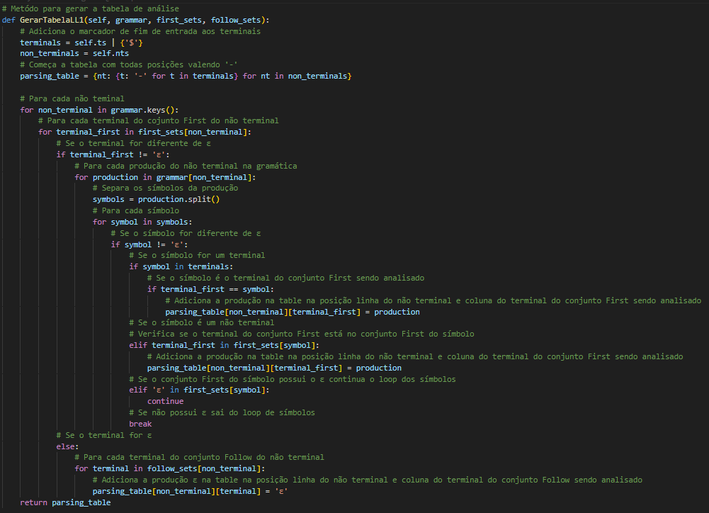

# Analisador Léxico e Sintático em Python

## Gabriel Teixeira Júlio e Marcus Vinícius Nogueira Santos

O objetivo deste código é a criação de um simples analisador léxico, este foi feito em Python e se encontra na pasta ***src***. Nela a três arquivos:

- ***main.py*** - arquivo para executar o analisador 
- ***analisadorLexico.py*** - arquivo que tem a implementação do AFD, tabela de tokes e tabela de símbolos
- ***tabelaLL1.py*** - arquivo que tem a implementação da tabela da gramática LL(1)
- ***analisadorSintatico.py*** - arquivo que está a implementação do analisador sintático

## Implementação

### *main.py*

No arquivo *main.py* inicialmente é requisitado o nome do arquivo da gramática e o símbolo inical, depois é feita a inicialização do AFD, a tabela de símbolos, lista de tokens e do analisador sintático. Depois perguntado o nome do arquivo do código a ser testado, após isso é feita análise léxica, depois é printada a tabela de símbolos e lista de tokens. Por último, é feita a análise sintática do código.



### *analisadorLexico.py*

Como dito anteriormente neste arquivo está a implementação do AFD, tabela de tonkes e tabela de símbolos. O AFD foi feito com base no AFD do arquivo *"AFDCompleto.pdf"* e os tokens foram criados baseados no arquivo *"Exemplos_Linguagem.pdf*.

#### AFD

O AFD é implementado em uma classe que tem o seguintes atributos:

- **inicial** - o estado inicial do autômato
- **atual** - o estado atual em que o autômato está
- **final** - todos os estados finais, e para cada estado o tipo de Token que ele representa e retorno que serve para dizer se precisa ou não voltar um caracter na cadeia sendo testada. Exemplo: "*'q2': {'tipo': 'ID', 'retorno': -1}*"
- **transicao** - todas as transições do autômato, para cada estado tem se todas suas transições em que cada transição tem os caracteres válidos da transcição e o estado de destino. Exemplo: "*'q5': [[D, 'q6']],*"

O método ***testaCaracter*** testa se caracter passado para o método manda para um estado válido, se vai para estado final ou se vai para um estado ínvalido. Ele segue a seguinte lógica:

1. Começa pegando todas as transições possíveis do estado atual do AFD
2. Para cada transição obtida é feito:
   1. Verifica se o caracter faz parte dos caracteres válidos da transição, senão for parte pula para próxima transição 
   2. Se for parte, o estado atual é atualizado para o estado de destino da transição
   3. Verifica se o estado atual é um estado final
      1. Se for final pega as informações do estado final, ou seja, o token
      2. Resta o estado atual para o inicial
      3. Retorna o Token, tipo e se precisa voltar um caracter da cadeia de teste
   4. Senão for o método retorna vazio
3. Se passar por todas as transições e não for caracter de nenhuma retorna um erro

O método ***testaLinha*** que testa uma linha inteira do código sendo analisado pois o AFD só testa um caracter por vez. O método usa alguns variáveis de apoios sendo elas: 

- **count** -  caracter da linha sendo analisado
- **word** - a palavra que está sendo montada ao passar pela linha, é reniciado quando um token é encontrado
- **resposta** - booleana para retornar se tudo ocorreu como devia ou não

O método segue a seguinte lógica:

1. Enquanto *count* for menor que o tamanho da lina
   1. Soma mais 1 em *count* e pega o caracter da linha na posição *count*
   2. Testa o caracter no AFD usando *testaCaracter*
   3. Atualiza o *count* com o valor de retorno do método *testaCaracter*
   4. Verifica se o método *testaCaracter* retornou um erro
   5. Se tiver retornado insere um Token 'ERRO' na tabela de tokens, *resposta* vira *False* e quebra o loop
   6. Senão retornou um erro:
      1. Adiciona o caracter testado em *word*
      2. Verifica o método *testaCaracter* retornou o tipo *SPACE* ou *BREAKLINE* se tiver reseta *word*
      3. Verica se o retorno de *testaCaracter* é diferente de '', *SPACE* e *BREAKLINE*
      4. Se for verifica se no retorno de *testaCaracter* pede para voltar um caracter, se pedir remove o ultimo caracter de *word*
      5. Verifica se o retorno de *testaCaracter* é *ID* 
         1. Se for verifica se é algum Token que é identificado como *ID* usnado *subtiposId* e guarda o resultado em *resp*
         2. Verifica se ainda é *ID* se for verifica se o *ID* já está na tabela de Símblos e guarda o retorno em *resp*
      6. Senão for e verifica se o retorno de *testaCaracter* for *>*, *>=*, *<*, *<=*, *!=* ou *==* se for *resp* vira o Token de *COMP*
      7. Senão *resp* recebe o tipo de Token do retorno de *testaCaracter*
      8. Verifica se *resp* é um Token *COMMENT*
         1. Se for reseta *word* pula para próxima iteração do loop
      9. Inseri o Token *resp* na tabela de Tokens
      10. Reseta *word*
2. Retorna *resposta*





#### Símbolos

A tabela de Símbolos é uma lista que guarda apenas os IDs idetificados pelo analiador.

O método ***inserirID*** serve armazenar na lista de símbolos o valor do ID e retorna para tabela de tokens o token deste ID, enviando como tipo ID e valor o índice do ID inserido na lista de símbolos.

O método ***findID*** é utilizado para verificar se um ID já está na lista de símbolos. Se ele estiver na lista de símbolos ele retorna para tabela de tokens o token deste ID, enviando como tipo ID e valor o índice do ID inserido na lista de símbolos, senão ele utiliza o método *inserirID* para inserir o ID na tabela de símbolos. 


#### Tokens

A tabela de Tokens é uma lista em que em cada posição do lista é guardado dois valores: 

- **Token** - guardo qual o tipo de token encontrado 
- **Value** - guarda o valor do token para os tonkes que necessitam, exemplo para toknes ID armazena o índice do ID na tabela de símbolos

O método ***inserirID*** serve para inserir um token(tipo, valor) na lista de tokens.



#### subtiposId

Para alguns IDs é necessário verificar se ele não é um Token válido, como INT ou FLOAT, pois o AFD não separa estes tokens de ID. Então o método ***subtiposId*** foi criado para verificar se um ID é um Token especial ou apenas um ID, por fim ele retorna o token correto.


### *tabelaLL1.py*

Como dito anteriormente neste arquivo está a implementação da tabela da gramática LL1. Para armazenar tabela foi criada a classe ***TableLL1*** que possui os atributos:

- ***start_symbol*** - símbolo inicial da gramática
- ***nts*** - guarda todos os não terminais da gramática
- ***ts*** - guarda todos os terminais da gramática tirado 'ε'
- ***parsing_table*** - que guarda a tabela de análise da LL(1)

A classe possui os seguintes métodos:

- ***LL1PeloArquivo*** - método para ler a gramática LL(1) de um arquivo e retorna ela num dicionário
- ***NaoTerminais*** - retorna todos os não terminais da gramática
- ***Terminais*** - retorna todos os terminais da gramática
- ***ConjuntosFirst*** - retorna todos os conjuntos First da grmática
- ***ConjuntosFollow*** retorna todos os conjuntos Follow da gramática
- ***GerarTabelaLL1*** - retorna a tabela de análise da gramática
- ***RetornarDerivacao*** - retorna a derivação de um não terminal para o terminal

No método contrutor da classe é passado o nome do arquivo da gramática e o símbolo inicial, depois é guardado o símbolo inicial, depois é pega a gramática pelo arquivo passado, após é armazendo os não terminais e os terminais, depois são gerados os conjuntos First e Follow e por último é gerada a tabela de análise.



#### LL1PeloArquivo

O método segue a seguinte lógica:

1. Inicialização da variável que guarda a gramática
2. Abre o arquivo para leitura pelo nome passado
3. Para cada linha no arquivo
   1. Se a linha está vazia pula ela
   2. Se não tiver '->' na linha pula ela
   3. Separa a linha por '->' e guarda o lado esquerdo (lhs) e lado direito (rhs)
   4. Separa as produções no lado direito (rhs) usando o '|' como separador
   5. Para cada produção
      1. Verifica se há dois '|' seguidos, indicando um terminal '||'
         1.  Adiciona '||' ao terminal
   6. As produções são adicionadas à lista associada ao lado esquerdo (lhs) no dicionário
4. Retorna a gramática como um dicionário 


#### NaoTerminais

O metódo retorna uma lista com todos os não terminais de uma gramática, ou seja, todas as chaves do dicionário.


#### Terminais

O método segue a seguinte lógica:

1. Pega todos os não terminais da gramática
2. Inicializa um conjunto vazio para guardr os terminais
3. Para cada lista de produção na gramática
   1. Para cada produção na lista
      1. Separa os símbolos da produção
      2. Para cada símbolo da produção
         1. Verifica se o símbolo não é ε e se o símbolo não é um terminal
            1. Adiciona o símbolo no conjunto de terminais
4. Retorna o conjunto de terminais



#### ConjuntosFirst

O método segue a seguinte lógica:

1. Inicializa para todos os não terminais os conjuntos First vazio
3. Para cada não terminal
   1. Usa o metódo recursivo *EncontrarFirstSet* para encontrar o conjunto First do não terminal
      1. Se o conjunto First já foi calculado
         1. Retorna o cojunto First
      2. Para cada produção do não terminal
         1. Separa os símbolos da produção
         2. Inicialiaza uma variável auxiliar *all_empty* como True
         3. Para cada símbolo da produção
            1. Se o símbolo for ε
               1. Adiciona o ε ao cojunto First do não terminal
               2. *all_empty* recebe False
               3. Sai do loop
            2. Verifica se o símbolo é um terminal
               1. Adiciona o símbolo ao cojunto First do não terminal
               2. *all_empty* recebe False
               3. Sai do loop
            3. Senão
               1. Gera o conjunto First do símbolo
               2. Adiciona o conjunto First do símbolo - {ε} ao conjunto First do não terminal
               3. Se ε não estiver nos símbolos do conjunto First do símbolo
                  1. *all_empty* recebe False
                  2. Sai do loop
         4. Verifica se *all_empty* for True
            1. Adiciona o ε ao conjunto First do símbolo
4. Retorna todos os conjuntos First



#### ConjuntosFollow

O método segue a seguinte lógica:

1. Inicializa para todos os não terminais os conjuntos Follow vazio
2. Adiciona $ ao conjunto Follow do símbolo inicial
2. Para cada não terminal
   1. Usa o metódo recursivo *follow_of* para encontrar o conjunto Follow do não terminal
      1. Se não existe o conjunto Follow para o symbol
         1. Gera o conjunto Follow para o symbol
      2. Para cada não terminal na gramática
         1. Para cada produção do não terminal
            1. Separa os símbolos da produção
            2. Verifica se o symbol aparece na produção
               1. Pega a posição do símbolo a direita de *symbol*
               2. Enquanto tiver símbolos a direita
                  1. Pega o próximo símbolo
                  2. Se o próximo símbolo for um não terminal
                     1. Adiciona o conjunto First do próximo símbolo ao conjunto Follow do *symbol*
                     2. Se não tiver ε no conjunto First do próximo símbolo 
                        1. Sai do loop
                  3. Senão
                     1. Adiciona o próximo símbolo ao conjunto Follow do *symbol*
                     2. Sai do loop
               3. Se o próximo símbolo for o último
                  1. Se *symbol* não for o não terminal
                     1.  Adiciona o conjunto Follow do não terminal ao conjunto Follow do *symbol* 
      3. Retorna o conjunto Follow do *symbol*  
3. Retorna todos os conjuntos Follow



#### GerarTabelaLL1

O método segue a seguinte lógica:

1. Pega todos os terminais mais o '$'
2. Pega todos os não terminais
3. Gera um dicionário para tabela. Cada não terminal (nt) tem um sub-dicionário onde cada terminal (t) mapeia para o valor '-', indicando inicialmente que não há produção associada
4. Para cada não terminal na gramática
   1. Para cada terminal no conjunto First do não terminal
      1. Se o terminal é diferente de ε
         1. Para cada produção do não terminal
            1. Separa os símbolos da produção
            2. Para cada símbolo da produção
               1. Se o símbolo é diferente de ε
                  1. Se símbolo for um terminal
                     1. Se o terminal do First for igual ao símbolo
                        1. Adicona a produção na tabela linha do não terminal e coluna do terminal do First 
                     2. Se o terminal do First está no conjunto First do símbolo
                        1. Adicona a produção na tabela linha do não terminal e coluna do terminal do First 
                     3. Se ε no conjunto First do símbolo
                        1. Continua o loop
                     4. Sai do loop
      2. Senão
         1. Para cada terminal no conjunto Follow do não terminal
            1. Adicona a produção 'ε' na tabela linha do não terminal e coluna do terminal do Follow
5. Retorna a tabela



#### RetornaDerivacao

O método serve para retornar a derivação de um símbolo (não terminal) para o símbolo da entrada (terminal) da tabela de análise.


### *analisadorSintatico.py*

Para trabalhar com o analisador sintático foi criado a classe ***Sintaico*** que tem o atributo ***ll1*** que é uma classe *TableLL1* que é gerada no método construtor da classe. A classe possui só um método chamado ***testaTokens*** que testa se uma lista de tokens está sintaticamente correta.

#### testaTokens

O método recebe a lista de tokens gerada pelo analisador léxico, onde uma cópia dela é armazenada como a entrada do analisador sintático. Depois é criada uma pilha vazia para guardar os símbolos utilizados pelo analisador.

O analisador começa como um loop infinito que segue a seguinte lógica:

1. Pega o primeiro símbolo da entrada 
2. Verifica se a pilha está vazia e o primeiro símbolo é '$'
   1. Printa que o código está sintaticamente correto.
3. Senão
   1. Pega o topo da pilha
   2. Verifica se o símbolo for um terminal e for diferente do símbolo incial da entrada
      1. Printa que o código está sintaticamente incorreto
      2. Printa que o erro foi ao comparar o topo da pilha com a entrada
   3. Verifica se o símbolo for diferente do símbolo incial da entrada
      1. Pega a derivação do símbolo para o símbolo incial da entrada usando *RetornarDerivacao* e inverte a ordem da derivação
      2. Para cada símbolo da derivação
         1. Se o símbolo for '-'
            1. Printa que o código está sintaticamente incorreto
            2. Printa que o erro foi que não a derivação so símbolo para símbolo incial da entrada
         2. Se o símbolo for diferente de 'ε'
            1. Empilha o símbolo na pilha
   4. Senão
      1. Remove o símbolo inicial da entrada


## Execução

Para executar o analisador basta executar o arquivo ***main.py*** e passar qual o nome do arquivo da gramática e qual o nome do arquivo do código a ser testado.

## Exemplos de entrada e saída

### Entrada

Exemplo de entrada correta 1:

```
main () {
    int x;
    x = 2;
    println(x);
}
```

Exemplo de entrada correta 2:

```
int teste (int x) {
    int y;
    y = 10;
}

main () {
    boolean x, y;
    x = 1;
    y = 0;
    while (x) {
        x = y;
    }
}
```

Exemplo de entrada errada:

```
int teste (int x) {
    int y;
    y = 10;
}
```

### Saída

As saídas serão a tabela de tokens, a tabela de símbolos e se está sintaticamente correto ou incorreto, além de mostrar qualque foi o erro.

Saída do exemplo de entrada correta 1:

```
Lista de Tokes
+---------+---------+
| Token   | Value   |
+=========+=========+
| MAIN    |         |
| (       | (       |
| )       | )       |
| {       | {       |
| INT     |         |
| ID      | 0       |
| ;       | ;       |
| ID      | 0       |
| =       | =       |
| NUM_INT | 2       |
| ;       | ;       |
| PRINTLN |         |
| (       | (       |
| ID      | 0       |
| )       | )       |
| ;       | ;       |
| }       | }       |
+---------+---------+
Tabela de Simbolos
+---------+------+
|   INDEX | ID   |
+=========+======+
|       0 | x    |
+---------+------+
Código sintaticamente correto!
```

Saída do exemplo de entrada correta 2:

```
Lista de Tokes
+---------+---------+
| Token   | Value   |
+=========+=========+
| INT     |         |
| ID      | 0       |
| (       | (       |
| INT     |         |
| ID      | 1       |
| )       | )       |
| {       | {       |
| INT     |         |
| ID      | 2       |
| ;       | ;       |
| ID      | 2       |
| =       | =       |
| NUM_INT | 10      |
| ;       | ;       |
| }       | }       |
| MAIN    |         |
| (       | (       |
| )       | )       |
| {       | {       |
| BOOLEAN |         |
| ID      | 1       |
| ,       | ,       |
| ID      | 2       |
| ;       | ;       |
| ID      | 1       |
| =       | =       |
| NUM_INT | 1       |
| ;       | ;       |
| ID      | 2       |
| =       | =       |
| NUM_INT | 0       |
| ;       | ;       |
| WHILE   |         |
| (       | (       |
| ID      | 1       |
| )       | )       |
| {       | {       |
| ID      | 1       |
| =       | =       |
| ID      | 2       |
| ;       | ;       |
| }       | }       |
| }       | }       |
+---------+---------+
Tabela de Simbolos
+---------+-------+
|   INDEX | ID    |
+=========+=======+
|       0 | teste |
|       1 | x     |
|       2 | y     |
+---------+-------+
Código sintaticamente correto!
```

Saída do exemplo de entrada errada:

```
Lista de Tokes
+---------+---------+
| Token   | Value   |
+=========+=========+
| INT     |         |
| ID      | 0       |
| (       | (       |
| INT     |         |
| ID      | 1       |
| )       | )       |
| {       | {       |
| INT     |         |
| ID      | 2       |
| ;       | ;       |
| ID      | 2       |
| =       | =       |
| NUM_INT | 10      |
| ;       | ;       |
| }       | }       |
+---------+---------+
Tabela de Simbolos
+---------+-------+
|   INDEX | ID    |
+=========+=======+
|       0 | teste |
|       1 | x     |
|       2 | y     |
+---------+-------+
Código sintaticamente incorreto
Não existe derivação para LISTAFUNCOES com $!
```