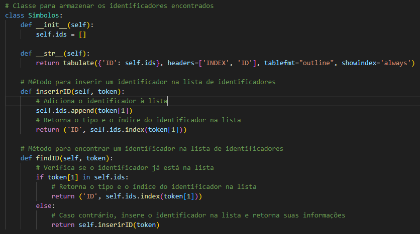
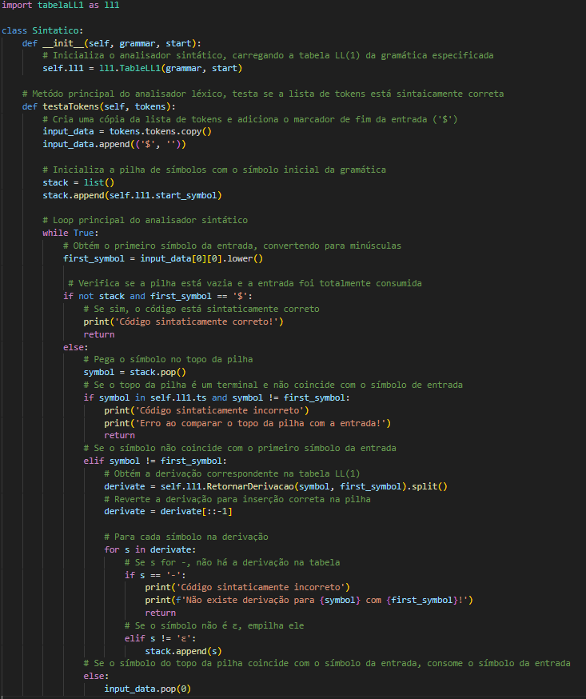

# Analisador Léxico Python

## Gabriel Teixeira Júlio

O objetivo deste código é a criação de um simples analisador léxico, este foi feito em Python e se encontra na pasta ***src***. Nela a três arquivos:

- ***main.py*** - arquivo para executar o analisador 
- ***analisadorLexico.py*** - arquivo que tem a implementação do AFD, tabela de tokes e tabela de símbolos
- ***tabelaLL1.py*** - arquivo que tem a implementação da tabela da gramática LL(1)
- ***analisadorSintatico.py*** - arquivo que está a implementação do analisador sintático

## Implementação

### *main.py*

No arquivo *main.py* inicialmente é requisitado o nome do arquivo da gramática e o símbolo inical, depois é feita a inicialização do AFD, a tabela de símbolos, lista de tokens e do analisador sintático. Depois perguntado o nome do arquivo do código a ser testado, após isso é feita análise léxica, depois é printada a tabela de símbolos e lista de tokens. Por último, é feita a análise sintática do código.

### *analisadorLexico.py*

Como dito anteriormente neste arquivo está a implementação do AFD, tabela de tonkes e tabela de símbolos. O AFD foi feito com base no AFD do arquivo *"AFDCompleto.pdf"* e os tokens foram criados baseados no arquivo *"Exemplos_Linguagem.pdf*.

#### AFD

O AFD é implementado em uma classe que tem o seguintes atributos:

- **inicial** - o estado inicial do autômato
- **atual** - o estado atual em que o autômato está
- **final** - todos os estados finais, e para cada estado o tipo de Token que ele representa e retorno que serve para dizer se precisa ou não voltar um caracter na cadeia sendo testada. Exemplo: "*'q2': {'tipo': 'ID', 'retorno': -1}*"
- **transicao** - todas as transições do autômato, para cada estado tem se todas suas transições em que cada transição tem os caracteres válidos da transcição e o estado de destino. Exemplo: "*'q5': [[D, 'q6']],*"

O método ***testaCaracter*** testa se caracter passado para o método manda para um estado válido, se vai para estado final ou se vai para um estado ínvalido. Ele segue a seguinte lógica:

1. Começa pegando todas as transições possíveis do estado atual do AFD
2. Para cada transição obtida é feito:
   1. Verifica se o caracter faz parte dos caracteres válidos da transição, senão for parte pula para próxima transição 
   2. Se for parte, o estado atual é atualizado para o estado de destino da transição
   3. Verifica se o estado atual é um estado final
      1. Se for final pega as informações do estado final, ou seja, o token
      2. Resta o estado atual para o inicial
      3. Retorna o Token, tipo e se precisa voltar um caracter da cadeia de teste
   4. Senão for o método retorna vazio
3. Se passar por todas as transições e não for caracter de nenhuma retorna um erro

O método ***testaLinha*** que testa uma linha inteira do código sendo analisado pois o AFD só testa um caracter por vez. O método usa alguns variáveis de apoios sendo elas: 

- **count** -  caracter da linha sendo analisado
- **word** - a palavra que está sendo montada ao passar pela linha, é reniciado quando um token é encontrado
- **resposta** - booleana para retornar se tudo ocorreu como devia ou não

O método segue a seguinte lógica:

1. Enquanto *count* for menor que o tamanho da lina
   1. Soma mais 1 em *count* e pega o caracter da linha na posição *count*
   2. Testa o caracter no AFD usando *testaCaracter*
   3. Atualiza o *count* com o valor de retorno do método *testaCaracter*
   4. Verifica se o método *testaCaracter* retornou um erro
   5. Se tiver retornado insere um Token 'ERRO' na tabela de tokens, *resposta* vira *False* e quebra o loop
   6. Senão retornou um erro:
      1. Adiciona o caracter testado em *word*
      2. Verifica o método *testaCaracter* retornou o tipo *SPACE* ou *BREAKLINE* se tiver reseta *word*
      3. Verica se o retorno de *testaCaracter* é diferente de '', *SPACE* e *BREAKLINE*
      4. Se for verifica se no retorno de *testaCaracter* pede para voltar um caracter, se pedir remove o ultimo caracter de *word*
      5. Verifica se o retorno de *testaCaracter* é *ID* 
         1. Se for verifica se é algum Token que é identificado como *ID* usnado *subtiposId* e guarda o resultado em *resp*
         2. Verifica se ainda é *ID* se for verifica se o *ID* já está na tabela de Símblos e guarda o retorno em *resp*
      6. Senão for e verifica se o retorno de *testaCaracter* for *>*, *>=*, *<*, *<=*, *!=* ou *==* se for *resp* vira o Token de *COMP*
      7. Senão *resp* recebe o tipo de Token do retorno de *testaCaracter*
      8. Verifica se *resp* é um Token *COMMENT*
         1. Se for reseta *word* pula para próxima iteração do loop
      9. Inseri o Token *resp* na tabela de Tokens
      10. Reseta *word*
2. Retorna *resposta*

#### Símbolos

A tabela de Símbolos é uma lista que guarda apenas os IDs idetificados pelo analiador.

O método ***inserirID*** serve armazenar na lista de símbolos o valor do ID e retorna para tabela de tokens o token deste ID, enviando como tipo ID e valor o índice do ID inserido na lista de símbolos.

O método ***findID*** é utilizado para verificar se um ID já está na lista de símbolos. Se ele estiver na lista de símbolos ele retorna para tabela de tokens o token deste ID, enviando como tipo ID e valor o índice do ID inserido na lista de símbolos, senão ele utiliza o método *inserirID* para inserir o ID na tabela de símbolos. 

#### Tokens

A tabela de Tokens é uma lista em que em cada posição do lista é guardado dois valores: 

- **Token** - guardo qual o tipo de token encontrado 
- **Value** - guarda o valor do token para os tonkes que necessitam, exemplo para toknes ID armazena o índice do ID na tabela de símbolos

O metódo ***inserirID*** serve para inserir um token(tipo, valor) na lista de tokens.

#### subtiposId

Para alguns IDs é necessário verificar se ele não é um Token válido, como INT ou FLOAT, pois o AFD não separa estes tokens de ID. Então o método ***subtiposId*** foi criado para verificar se um ID é um Token especial ou apenas um ID, por fim ele retorna o token correto.

### *tabelaLL1.py*

Como dito anteriormente neste arquivo está a implementação da tabela da gramática LL1. Para armazenar tabela foi criada a classe ***TableLL1*** que possui os atributos:

- ***start_symbol*** - símbolo inicial da gramática
- ***nts*** - guarda todos os não terminais da gramática
- ***ts*** - guarda todos os terminais da gramática tirado 'ε'
- ***parsing_table*** - que guarda a tabela de análise da LL(1)

A classe possui os seguintes metódos:

- ***LL1PeloArquivo*** - metódo para ler a gramática LL(1) de um arquivo e retorna ela num dicionário
- ***NaoTerminais*** - retorna todos os não terminais da gramática
- ***Terminais*** - retorna todos os terminais da gramática
- ***ConjuntosFirst*** - retorna todos os conjuntos First da grmática
- ***ConjuntosFollow*** retorna todos os conjuntos Follow da gramática
- ***GerarTabelaLL1*** - retorna a tabela de análise da gramática
- ***RetornarDerivação*** - retorna a derivação de um não terminal para o terminal

No metódo contrutor da classe é passado o nome do arquivo da gramática e o símbolo inicial, depois é guardado o símbolo inicial, depois é pega a gramática pelo arquivo passado, após é armazendo os não terminais e os terminais, depois são gerados os conjuntos First e Follow e por último é gerada a tabela de análise.

### *analisadorSintatico.py*

Para trabalhar com o analisador sintático foi criado a classe ***Sintaico*** que tem o atributo ***ll1*** que é uma classe *TableLL1* que é gerada no metódo construtor da classe. A classe possui só um metódo chamado ***testaTokens*** que testa se uma lista de tokens está sintaticamente correta.

#### testaTokens

O metódo recebe a lista de tokens gerada pelo analisador léxico, onde uma cópia dela é armazenada como a entrada do analisador sintático. Depois é criada uma pilha vazia para guardar os símbolos utilizados pelo analisador.

O analisador começa como um loop infinito que segue a seguinte lógica:

1. Pega o primeiro símbolo da entrada 
2. Verifica se a pilha está vazia e o primeiro símbolo é '$'
   1. Printa que o código está sintaticamente correto.
3. Senão
   1. Pega o topo da pilha
   2. Verifica se o símbolo for um terminal e for diferente do símbolo incial da entrada
      1. Printa que o código está sintaticamente incorreto
      2. Printa que o erro foi ao comparar o topo da pilha com a entrada
   3. Verifica se o símbolo for diferente do símbolo incial da entrada
      1. Pega a derivação do símbolo para o símbolo incial da entrada usando *RetornarDerivacao* e inverte a ordem da derivação
      2. Para cada símbolo da derivação
         1. Se o símbolo for '-'
            1. Printa que o código está sintaticamente incorreto
            2. Printa que o erro foi que não a derivação so símbolo para símbolo incial da entrada
         2. Se o símbolo for diferente de 'ε'
            1. Empilha o símbolo na pilha
   4. Senão
      1. Remove o símbolo inicial da entrada

## Execução

Para executar o analisador basta executar o arquivo ***main.py*** e passar qual o nome do arquivo da gramática e qual o nome do arquivo do código a ser testado.
